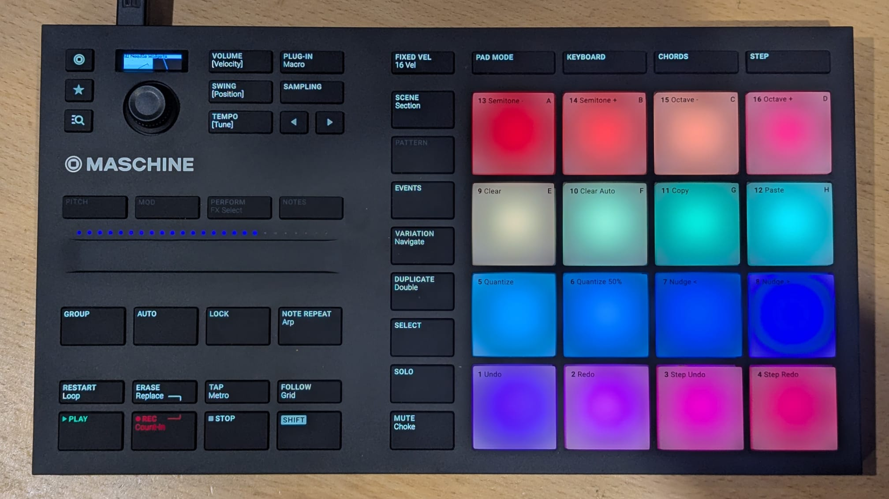

# Maschine.Api

[](https://www.nuget.org/packages/Maschine.Api/)
[](https://opensource.org/licenses/MIT)
[](https://app.codacy.com/gh/panoramicdata/Maschine.Api/dashboard?utm_source=gh&utm_medium=referral&utm_content=&utm_campaign=Badge_grade)

A .NET library for interacting with Native Instruments Maschine controllers over USB HID.

Current hardware support is focused on the **Maschine Mikro MK3** using USB VID `0x17CC` and PID `0x1700`.



## What This Library Covers

`Maschine.Api` provides a managed API over the Mikro MK3 HID protocol for:

- pad pressure input and RGB pad output
- button press/release state and button LED brightness output
- encoder delta input and volume-knob touch sensing
- the 25 physical touch-strip LEDs
- the Mikro MK3 monochrome dot-matrix display, including text, raw bitmaps, and widget dashboards
- testable device access through an injectable HID abstraction

## Installation

```bash
dotnet add package Maschine.Api
```

## Device Support

| Device | VID | PID | Status |
| --- | --- | --- | --- |
| Maschine Mikro MK3 | `0x17CC` | `0x1700` | Supported |

## Requirements

- .NET 10 or later
- a Maschine Mikro MK3 connected over USB
- HID access on the host OS
- on Windows, Native Instruments drivers as needed for normal HID access

## Quick Start

```csharp
using Maschine.Api;
using Maschine.Api.Models;

await using var client = new MaschineClient();
await client.ConnectAsync();

client.Pads.PadChanged += (_, pad) =>
{
    if (pad.IsPressed)
    {
        Console.WriteLine($"Pad {pad.Index} pressure={pad.Pressure}");
    }
};

client.Buttons.ButtonChanged += (_, button) =>
    Console.WriteLine($"Button {button.Index} {(button.IsPressed ? "down" : "up")}");

client.Encoders.EncoderChanged += (_, encoder) =>
    Console.WriteLine($"Encoder {encoder.Index} delta={encoder.Delta}");

await client.Pads.SetAllColorsAsync(PadColor.Blue);
await client.TouchStrip.SetAllLedsAsync(127);

Console.ReadLine();
await client.DisconnectAsync();
```

## Core API

The root entry point is `MaschineClient`, which implements `IMaschineClient`.

### `IMaschineClient`

Connection and global device services:

| Member | Purpose |
| --- | --- |
| `LedBrightnessPercent` | Global `0-100` scalar applied to pad and button writes. |
| `Pads` | Access to pad input state and RGB pad output. |
| `Buttons` | Access to button input state and button LED brightness output. |
| `Encoders` | Access to encoder delta events. |
| `TouchStrip` | Access to the 25 touch-strip LEDs. |
| `ConnectAsync()` | Opens the HID device and starts the background read loop. |
| `DisconnectAsync()` | Stops the read loop and releases the HID device. |
| `SetDotMatrixTestPatternAsync()` | Writes a simple display test pattern. |
| `ClearDotMatrixAsync()` | Clears the dot-matrix display. |
| `SetDotMatrixZebraLinesAsync()` | Writes a zebra-line display test pattern. |
| `SetDotMatrixBitmapAsync()` | Writes a raw packed 128x32 monochrome bitmap. |
| `SetDotMatrixTextAsync()` | Renders text using one of the supported display line layouts. |
| `SetDotMatrixDashboardAsync()` | Renders a widget dashboard once. |
| `SetDotMatrixWidgetsAsync()` | Renders a flat widget list once. |
| `RunDotMatrixDashboardLoopAsync()` | Continuously re-renders a dashboard at the requested frame rate. |

### `IPads`

Pad input and RGB output:

| Member | Purpose |
| --- | --- |
| `PadChanged` | Raised whenever a pad's pressure value changes. |
| `GetStates()` | Returns the last known state of all 16 pads. |
| `GetState(int padIndex)` | Returns a single pad's state. |
| `SetColorAsync(int padIndex, PadColor color)` | Sets one pad LED to an RGB color. |
| `SetAllColorsAsync(PadColor color)` | Sets all pad LEDs to the same RGB color. |

Pads report 12-bit pressure values via `PadState.Pressure` in the range `0..4095`.

### `IButtons`

Button input and button LED brightness output:

| Member | Purpose |
| --- | --- |
| `ButtonChanged` | Raised on any press or release transition. |
| `ButtonPressed` | Raised only on press transitions. |
| `ButtonReleased` | Raised only on release transitions. |
| `EncoderTouchChanged` | Reports capacitive touch and absolute knob position for the volume encoder. |
| `GetStates()` | Returns the last known state of all buttons. |
| `GetState(int buttonIndex)` | Returns a single button state. |
| `SetLedAsync(int buttonIndex, byte brightness)` | Sets one button LED brightness. |
| `SetAllLedsAsync(byte brightness)` | Sets all button LEDs to the same brightness. |
| `SetOnOffAsync(int buttonIndex, bool isOn)` | Convenience wrapper for on/off control. |
| `SetAllOnOffAsync(bool isOn)` | Convenience wrapper for all-button on/off control. |

Button LEDs are currently exposed as brightness-only in the public API.

### `IEncoders`

Encoder input:

| Member | Purpose |
| --- | --- |
| `EncoderChanged` | Raised when any encoder emits a signed relative delta. |

Each event carries an `EncoderDelta` with:

- `Index`: zero-based encoder index
- `Delta`: signed movement where positive is clockwise and negative is counter-clockwise

### `ITouchStrip`

Touch-strip LED output:

| Member | Purpose |
| --- | --- |
| `SetLedAsync(int position, byte brightness)` | Sets one strip LED brightness. |
| `SetAllLedsAsync(byte brightness)` | Sets all 25 strip LEDs to one brightness. |
| `SetLedsAsync(IReadOnlyList<byte> brightnessValues)` | Writes all 25 strip LEDs in one call. |
| `SetLedsAsync(IReadOnlyList<PadColor> colors)` | Writes all 25 strip LEDs as colors in one call. |

The Mikro MK3 exposes 25 physical touch-strip LEDs. The API uses zero-based positions `0..24`.

## Models and Supporting Types

### Connection and device information

| Type | Purpose |
| --- | --- |
| `MaschineClientOptions` | Controls VID/PID matching, selected device index, unified-light mode, tracing, and global LED brightness scaling. |
| `MaschineDeviceConstants` | Known hardware constants such as pad count, button count, encoder count, and touch-strip LED count. |
| `MaschineDeviceNotFoundException` | Thrown when no matching device is found for the configured VID/PID. |

### Input state models

| Type | Purpose |
| --- | --- |
| `PadState` | Zero-based pad index and 12-bit pressure value. |
| `ButtonState` | Button index, pressed state, and mapped `MikroMk3Button` enum when known. |
| `EncoderDelta` | Signed relative encoder motion. |
| `EncoderTouchState` | Volume knob touch state and absolute knob position `0..15`. |

### Display and rendering models

| Type | Purpose |
| --- | --- |
| `DisplayLineMode` | Predefined text layouts for `SetDotMatrixTextAsync()`. |
| `DisplayZone` | Rectangular widget placement on the 128x32 display. |
| `TextFontKind` | Available text fonts for display widgets. |
| `TextOverflowMode` | Text clipping, ellipsis, or scrolling behavior. |
| `FontGlyph` | Low-level glyph data used by the display renderer. |
| `TransportSymbol` | Symbol identifiers used by the display rendering layer. |
| `VuWidgetStyle` | Style options for `VuWidget`. |
| `VuNeedleDetailMode` | Detail options for needle-style VU rendering. |

### Color model

`PadColor` is a 24-bit RGB record struct and includes these convenience values:

- `PadColor.Off`
- `PadColor.White`
- `PadColor.Red`
- `PadColor.Green`
- `PadColor.Blue`

## Dot-Matrix Display API

The Mikro MK3 display is a 128x32 monochrome panel exposed through several layers:

- raw bitmap output with `SetDotMatrixBitmapAsync()`
- line-based text rendering with `SetDotMatrixTextAsync()`
- widget dashboards with `DotMatrixDashboard` and `IDotMatrixWidget`

Built-in widget types currently include:

- `TextWidget`
- `VuWidget`
- `SpectrumWidget`
- `EqWidget`

## Demo Application

The repository includes an interactive console demo in `Maschine.Demo`.

Run it with:

```bash
dotnet run --project "Maschine.Demo\Maschine.Demo.csproj"
```

### What the demo does

The demo is designed to prove the current device integration end to end.

- connects to the first matching Mikro MK3 by default
- forces unified light output by default so LED behavior works out of the box on current hardware
- downloads and caches a public-domain demo drum soundfont on first run if it is not already present
- starts the touch strip at midpoint position `13`
- uses the touch strip LEDs as a colored level bar driven by the strip/slider control
- uses the touch strip position as the demo drum master volume
- cycles physical button LEDs through brightness levels when you press them
- flashes pads white while they are pressed, then restores their base colors when released
- triggers velocity-aware drum hits from pad pressure values when the demo audio kit is available
- runs the dot-matrix dashboard showcase by default
- clears pads, buttons, touch strip, and display on shutdown as a best-effort cleanup step

### Demo command-line options

| Option | Purpose |
| --- | --- |
| `--list-devices` | Enumerates matching HID devices and exits. |
| `--device-index <n>` | Selects a specific matching HID device when multiple are attached. |
| `--log-level <level>` | Sets the console log level. |
| `--trace-input` | Enables raw HID input report tracing. |
| `--trace-only` | Connects and logs raw input without running demo logic. |
| `--led-test` | Runs the LED self-test routine. |
| `--full-brightness` | Sets pads and buttons to maximum brightness. |
| `--pad-color-space` | Writes the pad color-space demonstration. |
| `--force-unified` | Explicitly forces unified light packet output. |

## Example: Device Selection and Brightness Scaling

```csharp
using Maschine.Api;
using Maschine.Api.Models;

var options = new MaschineClientOptions
{
    DeviceIndex = 0,
    ForceUnifiedLightOutput = true,
    GlobalLedBrightnessPercent = 60,
};

await using var client = new MaschineClient(options);
await client.ConnectAsync();

await client.Pads.SetColorAsync(0, new PadColor(255, 64, 0));
await client.Buttons.SetLedAsync(0, 127);

await client.DisconnectAsync();
```

## Example: Dot-Matrix Text

```csharp
using Maschine.Api;
using Maschine.Api.Models;

await using var client = new MaschineClient();
await client.ConnectAsync();

await client.SetDotMatrixTextAsync(
    ["Maschine.Api", "Mikro MK3", "USB HID", "Ready"],
    DisplayLineMode.FourRows);

Console.ReadLine();
await client.ClearDotMatrixAsync();
await client.DisconnectAsync();
```

## Example: Touch Strip Gradient

```csharp
using Maschine.Api;
using Maschine.Api.Models;

await using var client = new MaschineClient();
await client.ConnectAsync();

var colors = Enumerable.Range(0, MaschineDeviceConstants.MikroMk3TouchStripLedCount)
    .Select(i => new PadColor((byte)(255 - i * 8), 0, (byte)(i * 8)))
    .ToArray();

await client.TouchStrip.SetLedsAsync(colors);

Console.ReadLine();
await client.DisconnectAsync();
```

## Testing

The solution is structured to be testable without real hardware by injecting an `IHidDeviceFactory` and fake HID devices in unit tests.

Run the test project with:

```bash
dotnet test .\Maschine.Api.Test\Maschine.Api.Test.csproj
```

## License

MIT. See [LICENSE](LICENSE) for details.

Third-party font attributions are documented in [THIRD-PARTY-NOTICES.md](THIRD-PARTY-NOTICES.md).
